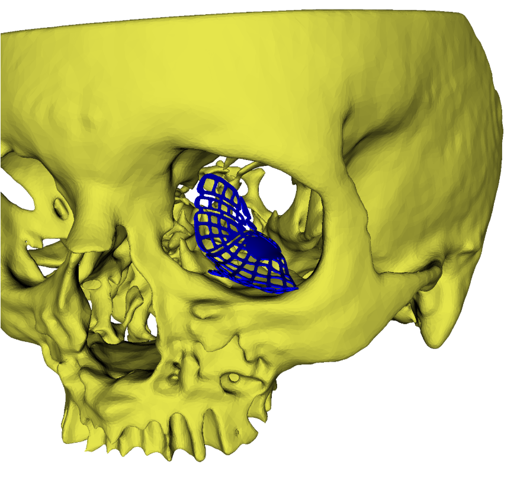

# SlicerOrbitSurgerySim  
### A 3D Slicer extension for orbital fracture repair planning and simulation

**SlicerOrbitSurgerySim** is a 3D Slicer extension for **interactive registration, evaluation, and comparison of preformed orbital plates** used in the repair of orbital fractures. The extension supports systematic comparison of plate fit across **different vendors, plate sizes, and placement strategies**, enabling quantitative assessment for research and clinical decision support.

> 📖 **If you use **SlicerOrbitSurgerySim** in your research, please cite:**
>
> **Zhang, C., Gunn, B., & Read-Fuller, A. M. (2025).**  
> *SlicerOrbitSurgerySim: An Open-Source Platform for Virtual Registration and Quantitative Comparison of Preformed Orbital Plates.*  
> arXiv:2512.19534 — https://arxiv.org/abs/2512.19534

For clinical background on the use of preformed and customized plates in orbital fracture repair, see this AO CMF reference:  
https://surgeryreference.aofoundation.org/cmf/trauma/midface/orbit-floor/reconstruction

  

Example of a widely used preformed orbital plate registered to a reconstructed orbit using the <strong>PlateRegistration</strong> module.

---

## Modules

At present, the extension includes two primary modules:

### 1. **PlateRegistration**

The **PlateRegistration** module enables users to:

- Interactively adjust plate position using 3D transform handles  
- Register preformed orbital plates to reconstructed or native orbit models  
- Compute repeatable, quantitative plate-to-orbit fit metrics  
- Compare plate fit across vendors, plate sizes, or alternative placements of the same plate  

The generated metrics support **plate ranking**, visualization, and downstream statistical analysis.

---

### 2. **MirrorOrbitRecon**

The **MirrorOrbitRecon** module reconstructs the fractured orbit using a mirrored model of the contralateral (uninjured) side. A reconstructed orbit is **strongly recommended** for robust and interpretable plate fit assessment.

Core functionality includes:
- Rigid and affine registration
- Dependency: [**SlicerMorph**](https://github.com/SlicerMorph/SlicerMorph?tab=BSD-2-Clause-1-ov-file) extension  

---

## Installation

**SlicerOrbitSurgerySim** is distributed through the official **3D Slicer Extension Manager**.

1. Install **3D Slicer 5.10.0** from:  
   https://download.slicer.org/

2. Open [**Extension Manager**](https://slicer.readthedocs.io/en/latest/user_guide/extensions.html) (top-right corner of the Slicer interface).

3. Search for **SlicerOrbitSurgerySim**, install the extension, and **restart Slicer**.

---

## Get Started

### New users
Follow the step-by-step **[Quick Tutorial: Plate Registration and Fit Comparison](Tutorials/00_Quick_Tutorial.md)**  
*(~10–20 minutes, **prepared sample data included and downloadable directly from Slicer**)*

### Video tutorials

- **Plate registration workflow**  
  [Tutorial 1: Plate registration](https://youtu.be/GVo89_oOOGM?si=q0GWMU0vH_xGB2DE)

- **Generate plate fit metrics**  
  [Tutorial 2: Generate fit metrics](https://www.youtube.com/watch?v=IyLVJwoHqCc&list=PLvFNLt1ZOjPL5FHAWSB3U7QnUEgU7rQY-&index=2)

- **Compare fit of multiple plates**  
  [Tutorial 3: Compare plate fit](https://www.youtube.com/watch?v=P6sXtbH0i2w&list=PLvFNLt1ZOjPL5FHAWSB3U7QnUEgU7rQY-&index=3)

- **Edit pre-registered plates and combine results**  
  [Tutorial 4: Edit pre-registered plate](https://www.youtube.com/watch?v=EaOGQawftLU&list=PLvFNLt1ZOjPL5FHAWSB3U7QnUEgU7rQY-&index=4)

- **Fractured orbit reconstruction using contralateral mirroring**  
  [MirrorOrbitRecon tutorial](https://youtu.be/t951sCvk_lc?si=wHra2VXSp__asPQt)

### Detailed tutorials: 
Detailed tutorials explaining the underlying registration, reconstruction, and fit metric methods will be added soon.

## Acknowledgements

The 3D Slicer community offered important technical advice and feedback during development, especially **Kyle Sunderland** (Perk Lab, Queen’s University), who developed the Interaction Transform Handle in Slicer, as well as **Dr. Andras Lasso** (Perk Lab, Queen’s University) and **Dr. Steve Pieper** (Isomics, Inc.).

**Dr. Andrew Read-Fuller** (Texas A&M University College of Dentistry) contributed essential clinical insights that helped shape the design and evaluation of this work. **Braedon Gunn** (Texas A&M University College of Dentistry) meticulously segmented numerous fractured orbital datasets and tested the extension on multiple patient scans, providing critical validation and feedback.

The rigid (ITK-based) and affine registration components build upon methods originally developed for the **ALPACA** and **FastModelAlign** modules of the [**SlicerMorph**](https://github.com/SlicerMorph) extension, developed by **Dr. A. Murat Maga**’s laboratory.

This project was supported by a **Seedling Grant** from the **Texas A&M University Health Science Center**, awarded to **Chi Zhang**.
