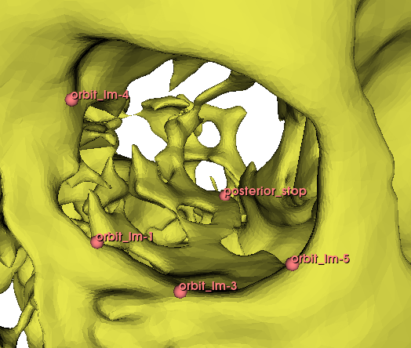
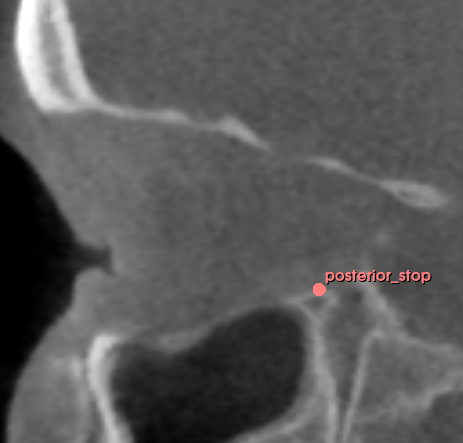
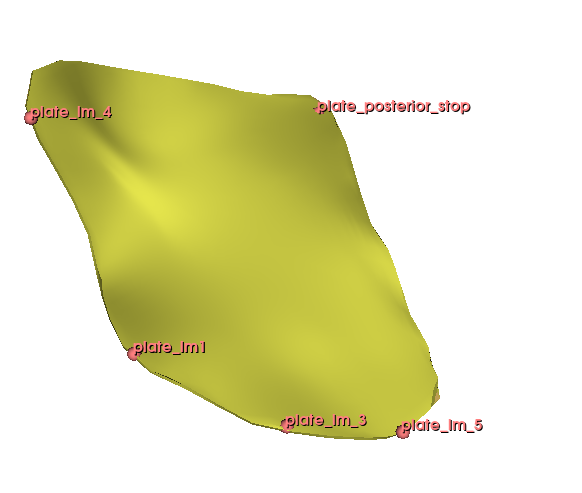
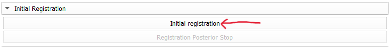

# Plate Registration Tutorial
Plate registration requires placing plates at the surface of the intact peripheral bone of the fracture site. 
Conventional registration typically produced overlapping between models. 
This would impact accuracy of virtual planning and fit evaluation.
The PlateRegistration module utilized the new Slicer tool, Interaction Transform Handle, and utility tools (e.g., instant intersection markers, collision detection and markers, align posterior stop) to facilitate users to **interactively** adjust plate position until resting just above the peripheral bone.

This tutorial provides a detailed walkthrough and description of methods for **registering two preformed orbital plates** using **sample data prepared with this extension**.

Video tutorial is available at: [Tutorial 1: Plate registration](https://youtu.be/GVo89_oOOGM?si=q0GWMU0vH_xGB2DE)

This tutorial will use the sample data as an example.

To install the extension and load the **sample data**, see **[Quick Tutorial: Plate Registration and Fit Comparison](00_Quick_Tutorial.md)** 
=
---

# 1.Load data

## Load skull and plate models and landmark files
From the unzipped sampled data folder, drag and drop below files into Slicer:
- `skull_sample_left_fracture.ply`
- `left_orbit_lm.mrk.json`
- `synth_plate_large_left.ply`
- `synth_plate_large_left_lm.mrk.json` 
Click **OK** when prompted.

## Load the reference CT volume
In **Sample Data**, click **CBCTDental Surgery**. The CT volume will be loaded automatically 
The CT volume will load automatically (the skull model is segmented from the 'PostDentalSurgery' volume).)

> Note: if using your own data, please segment the CT volume to create a skull model with fractured orbit.

## Open PlateRegistration and Select Inputs

Open **Module Finder**, type **PlateRegistration**, and switch to the module.

> **First-time use notice**  
> Required Python packages will be installed automatically.  
> This may take a few minutes. Please do not close Slicer.

In the **Input** section:
   - Select the **orbit model**
   - Select the **plate model**
   - Select the corresponding **landmark files**

## Orbit and plate landmarking
The initial coarse plate registration relies on landmark registration.
In the sample data, five landmarks were annotated on the plate and orbit.

  

Other than the **posterior stop** landmark, all others do not require accurate correspondence.
The **posterior stop** represents the orbital process of the palatine bone and usually serves as the posterior fixation point.
Other landmarks are for ensuring the orientation of the plate is appropriate before manual adjustment.

To create orbital and plate landmarks, users can switch to the Markups module and create point lists.
See tutorial here: [SlicerMorph tutorials for Markups module](https://github.com/SlicerMorph/Tutorials/tree/main/Markups_1)

> Note:
> Make sure that the order of landmarks are the same in both orbital and plate landmark lists.
> Particularly, the current PlateRegistration module treats the second landmark in a landmark list as the posterior stop.

---

# 2. Initial Registration

## Rigid registration

In **Initial Registration**, click **Initial registration**

You should see:

The function first performs a **rigid registration** that aligns the plate landmark list to the orbit landmark list.
The generated transformation matrix is then used to align the plate to the orbit.

## Posterior stop alignment

Click 

In **Initial Registration**, click:
- **Initial registration**
- **Registration posterior stop**

The plate should now be roughly aligned with the orbit.

A new folder will appear in the **Node Viewer** to store registration results.  
Folder name format: _plate_model_name_timestamp_
- A timestamp is appended to ensure unique folder names

# 3. Manual adjustment

Initial Registration

Align to posterior stop.

Activate the interaction transform handle.

The module offers multiple tools to assist the process.

Collision Detection and Collison Marker

Instant colormap indicating intersection

Instant Collision Detection and marker. Not recommended.

Distance heatmap.

Realign to the original posterior stop.

Restart to initial position.

Rest.

Once everything is done, click "Finalize results".

Save Results.
